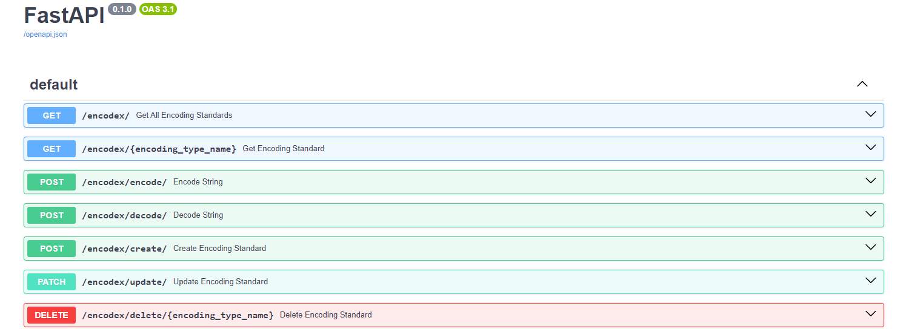

# Encodex

Encodex is an API built with Python's FastAPI framework. It provides a robust and flexible solution for creating, managing, and using custom encoding standards. You can define your own encoding standards, apply them to encode and decode data, and then store and retrieve them from a MySQL database. This makes Encodex a practical tool for managing encoding standards in software development projects.

## Overview


## Installation
Docker is required to run this project.

```bash
# Clone the repository
git clone https://github.com/MathisJANKOVIC/Encodex.git

# Go to the project directory and setup docker services
docker compose up -d

# Enter the FastAPI container
docker exec -it encodex-fastapi bash

# Migrate the database
python src/database/models.py
```
You will then be able to see docs and routes at `http://localhost:8000/docs`